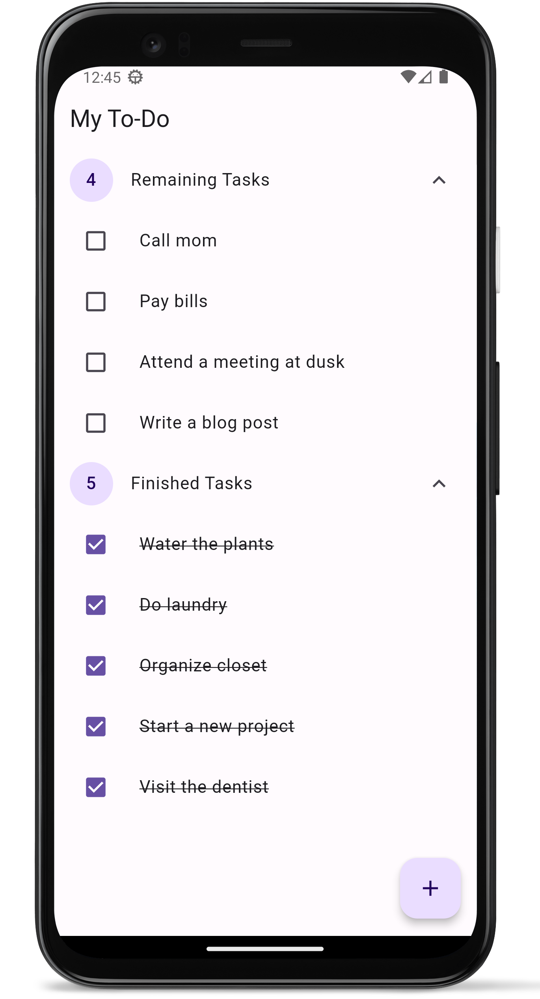

# Todo App


A simple Todo App built with Flutter that supports basic CRUD operations on todos. It features a clean user interface with Material 3 design principles and supports auto dark mode based on the system settings.

## Features

- Create new todos with title
- Mark todos as completed or uncompleted
- Edit existing todos to update their titles
- Delete unwanted todos
- Supports auto dark mode based on system settings
- Dynamic theme based on wallpaper colors

## Screenshots

<div style="display: flex; justify-content: center; align-items: center;">
  

  
</div>

## Getting Started

### Prerequisites

- Flutter SDK: [Installation Guide](https://flutter.dev/docs/get-started/install)

### Installation

1. Clone the repository:

    ```shell
    git clone https://github.com/Endeavor36/todo_app.git

2. Navigate to the project directory:

    ```shell
    cd todo_app

3. Install the dependencies:

    ```shell
    flutter pub get

### Usage

1. Connect your device or emulator.
2. Run the app.

    ```shell
    flutter run

This will start the Todo App on your connected device or emulator. You can now explore the app's features and functionality.

## Contributions

Contributions are welcome! If you have any ideas, suggestions, or bug reports, please open an issue or submit a pull request. For major changes, please open an issue first to discuss your proposed changes.
